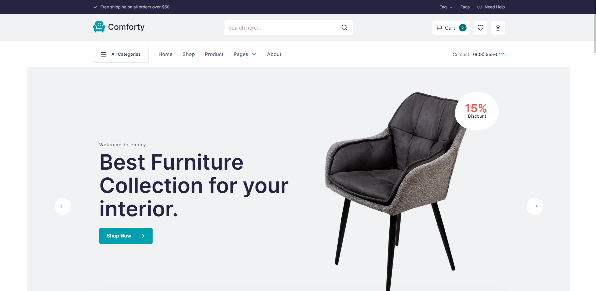

# [Echotemplate.com](https://echotemplate.com)
FREE UI & HTML Templates for Designer and Developer. Echotemplate is a place where a team of design & developers create beautiful templates. Visit [Echotemplate.com](https://echotemplate.com) for more updates.

# [comforty-ecommerce-html-template](https://github.com/echotemplate/comforty-ecommerce-html-template)

> Comforty eCommerce HTML template is a template which made for niche type eCommerce site

This project is a html version [comforty-ecommerce-html-template](https://github.com/echotemplate/comforty-ecommerce-html-template) designed with HTML & CSS. We use tailwindcss framework and some javascripts plugin. For slider we use swipper js.

Check the [Live Demo here](https://demo.echotemplate.com/comforty-ecommerce-html-template/).

## Credits
- Design by [Zafor](https://www.linkedin.com/in/)
- Coded by [Rakibul Islam](https://github.com/Rakib0101) and [Hasibur Rahman](https://github.com/emon21)

## License
The MIT License (MIT). Please see [License File](LICENSE.md) for more information.
